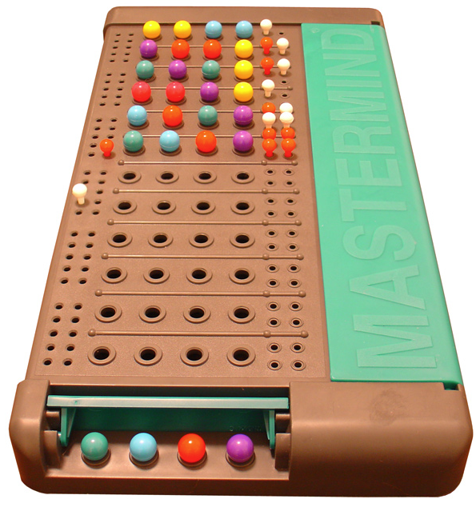

# Mina zkApp: Mina Mastermind



# Table of Contents

## Mastermind Game Documentation

- [Understanding the Mastermind Game](#understanding-the-mastermind-game)

  - [Overview](#overview)
  - [Game Rules](#game-rules)

- [Introduction](#introduction)
- [System Architecture](#system-architecture)
- [Repository Structure](#repository-structure)
- [How to Build & Test](#how-to-build--test)
  - [How to build](#how-to-build)
  - [How to run tests](#how-to-run-tests)
  - [How to run coverage](#how-to-run-coverage)
- [Running with Lightnet](#running-with-lightnet)
  - [Prerequisites](#1-prerequisites)
    - [Install Docker](#install-docker)
  - [Running Lightnet](#2-running-lightnet)
  - [Running the Application](#3-running-the-application)
  - [Working with Lightnet Test Accounts](#working-with-lightnet-test-accounts)
    - [HTTP GET](#http-get)
    - [Supported Query Parameters](#supported-query-parameters)
    - [Example Request](#example-request)
    - [Example Response](#example-response)
  - [Adding the Lightnet Network to Auro Wallet](#adding-the-lightnet-network-to-auro-wallet)
  - [Adding the Test Account to Auro Wallet](#adding-the-test-account-to-auro-wallet)
- [License](#license)

# Understanding the Mastermind Game

## Overview

- The game involves two players: a `Code Master` and a `Code Breaker`.
- Inspired by [mastermind-noir](https://github.com/vezenovm/mastermind-noir), this version replaces colored pegs with a combination of 4 unique digits between 0 and 7.

## Game Rules

- The Code Master hosts a game and sets a secret combination for the Code Breaker to guess.

- The Code Breaker makes a guess and waits for the Code Master to provide a clue.

- The clue indicates the following:

  - **Hits**: Digits that are correctly guessed and in the correct position.
  - **Blows**: Digits that are correct but in the wrong position.

  Example:

  |        | P1  | P2  | P3  | P4  |
  | ------ | --- | --- | --- | --- |
  | Secret | 5   | 0   | 3   | 4   |
  | Guess  | 5   | 7   | 6   | 0   |

  |      | Hits | Blows |
  | ---- | ---- | ----- |
  | Clue | 1    | 1     |

  - Code Master's secret combination: **5 0 3 4**
  - Code Breaker's guess: **5 7 6 0**
  - Result: `1` hit and `1` blow.
    - The hit is `5` in the first position.
    - The blow is `0` in the fourth position.

- The game continues with alternating guesses and clues until the Code Breaker achieves 4 hits and uncovers the secret combination or fails to do so within the **maximum allowed attempts**.

# Introduction

Mina Mastermind is a zero-knowledge (ZK) adaptation of the classic Mastermind game, built on the Mina blockchain. It leverages Mina’s ZK infrastructure to provide privacy, programmability, and recursion for verifying game logic on a trustless, decentralized layer. Built on top of Mina’s native payment system, it also enables players to securely place bets, with outcomes enforced by off-chain proofs and finalized on-chain, ensuring fairness, transparency, and a smooth gameplay experience.

## System Architecture

This section provides a high-level overview of how the different components interact throughout the game lifecycle. It includes a visual representation of the system architecture, illustrating the flow of data and responsibilities across the zkApp, server, worker, database, and UI.

Understanding this diagram is essential for grasping:

- The separation of concerns across components
- How game state and zero-knowledge proofs are handled
- The role of background workers and persistent storage
- The communication patterns between clients, backend services, and the Mina blockchain

### Diagram

You can view the full architecture diagram here: [System Architecture Diagram on Excalidraw](https://excalidraw.com/#json=8TJUSk6bhCl__6YvDXLR5,aJl72tc6Dbc5P0P6MZC7Eg)

For more details about the zkApp contract and zkProgram, please refer to the dedicated repository:  
[recursive-mastermind-zkApp](https://github.com/mina-builders-team/recursive-mastermind-zkApp)

# Repository-Structure

This section describes the folder structure and the purpose of each major file or directory in this repository.

```sh
├── cache/
├── integration-test/
├── server/
├── ui/
├── worker/

```

---

## 📂 `cache/`

- **Purpose**: Generates zkApp/zkProgram compilation artifacts for browser-side loading.
- **Structure**:

```sh
├── cache/
│   └── src/
│       └── cache.ts

```

- **Running This Service**: Follow these steps to install dependencies, build the project, and generate the required compilation files:

```bash
yarn install
yarn build
yarn start
```

Running the above commands will generate two folders:

zkAppCache/ – contains compilation zkApp files.

zkProgramCache/ – contains compilation zkProgram files.

Note: You may need to run yarn start multiple times (typically 3–5 times) until all the required compilation files are fully generated.

---

## 📂 `integration-test/`

- **Purpose**: Simulates end-to-end interactions between frontend and backend, including multi-client scenarios.
- **Structure**:

```sh

├── integration-test/
│   ├── index.ts   #Orchestrates the creation of a queue of Mastermind games. Each game is processed
│   ├              #by an isolated worker,allowing testing of asynchronous and multi-client game play.
│   ├── games.json #mock game definitions.Each game entry includes codeMaster, codeBreaker and attempts.
│   ├── .env.simulate.devnet.example #Example env file for Devnet-based simulations
│   ├── .env.simulate.lightnet.example #Example env file for Lightnet-based simulations
│   ├── .env.test.devnet.example #Example env file for Devnet-based Jest tests
│   ├── .env.test.lightnet.example #Example env file for Lightnet-based Jest tests
├── docker/
│   └── Dockerfile.dev #Dockerfile to build a client worker for test simulations.
├── src/
│   ├── worker.ts #Handles job queue consumption to simulate player interactions.
│   ├── websocket.ts #Mock frontend WebSocket class for server simulation.
│   ├── mastermindGame.ts #Manages the entire game lifecycle and zkApp interaction.
│   └── test/
│       └── mastermind.test.ts #Tests gameplay flow, proof validation, error cases.

```

- **Running This Service**: The `integration-test/` folder includes two types of tests:

### 1. Unit & Game Flow Tests

These are defined in `src/test/mastermind.test.ts` and cover:

- Game creation
- Error scenarios (invalid inputs, unauthorized actions)
- Game progression lifecycle
- zkApp and proof validation

#### To run them:

```bash
# Set up environment variables
cp .env.example .env  # Copy root env
cp server/.env.test.lightnet.example server/.env # Or use .env.test.devnet.example depending on the network
cp worker/.env.test.lightnet.example worker/.env # Or use .env.test.devnet.example depending on the network

# Move to integration test folder
cd integration-test
cp .env.test.lightnet.example .env #Or use cp .env.test.devnet.example .env depending on the network
# Start containers
docker-compose --profile test up -d #Start the needed containers using Docker Compose
 # Install dependencies
yarn install
# Run test
yarn test src/test/mastermind.test.ts
```

---

### 2. Multi-Game Queue Simulation Tests

These tests simulate multiple games being created and played simultaneously, handled via a queue and processed by separate worker containers.

#### Setup:

- `index.ts` pushes game creation jobs into a Redis queue.
- Worker containers (built via Docker) consume and process the jobs.

#### Steps to run:

```bash
# Set up environment variables
cp .env.example .env  # Copy root env
cp server/.env.test.lightnet.example server/.env # Or use .env.test.devnet.example depending on the network
cp worker/.env.test.lightnet.example worker/.env # Or use .env.test.devnet.example depending on the network

# Move to integration test folder
cd integration-test
cp .env.simulate.lightnet.example .env #Or cp .env.simulate.devnet.example .env depending on the network you're using
docker-compose --profile simulate up -d  # Start the needed containers using Docker Compose
```

> You can monitor and scale worker containers to test concurrency and performance.

---

## 📂 `ui/`

- **Purpose**: The web interface for players.

- **Structure**:

```
ui/
├── docker/
│   └── dockerfile.dev    # Builds the frontend container for local/dev use
├── functions/
│   └── _middleware.ts    # Cloudflare Pages headers
├── public/
│   ├── zkAppCache/       # Stores cached zkApp compilation files.
│   └── zkProgramCache/   # Stores cached zkProgram files.
├── .env.lightnet.example # Example env files for Lightnet
├── .env.devnet.example   # Example env files for Devnet
└── src/
    ├── components/          # Reusable UI components
    ├── composable/          # Vue composables (reusable logic)
    ├── constants/
    │   └── config.ts        # Game config (e.g., max_attempts)
    ├── router/
    │   └── index.ts         # UI routes
    ├── services/
    │   └── websocket.ts     # WebSocket logic
    ├── store/
    │   └── zkAppModule.ts   # Pinia store for zkApp state
    ├── views/               # Page-level components
    ├── zkappWorkerClient.ts # Interface to communicate with the zkApp web worker
    ├── zkappWorker.ts       # Logic executed by web workers
    ├── utils.ts             # Project-wide helper functions
    ├── types.ts             # Type declarations
```

---

- **Running This Service**: Refer to the [Running the Application](#3-running-the-application) section under _Running with Lightnet_.  
  _Note: To use Devnet instead, simply rename `.env.devnet.example` to `.env` instead of `.env.lightnet.example`._

## 📂 `server/`

- **Purpose**: Handles REST APIs, WebSocket communication, game management, and zkApp validation.

- **Structure**:

```
server/
├── docker/
│   ├── dockerfile.dev      # Dev Docker image.
│   └── dockerfile.prod     # Production Docker image.
├── .env.lightnet.example   # Example env files for Lightnet
├── .env.devnet.example     # Example env files for Devnet
└── src/
    ├── models/
    │   └── Game.ts             # Mongoose schema for Game documents
    ├── repositories/
    │   └── game.ts             # DB interactions for Game model
    ├── routes/
    │   └── gamesRoute.ts       # REST API routes
    ├── constants.ts            # Shared constants
    ├── databaseConnection.ts   # MongoDB connection handler
    ├── index.ts                # Entry point of the Express server
    ├── instrument.ts           # Sentry initialization
    ├── redisClient.ts          # Redis connection logic
    ├── services.ts             # WebSocket message handling
    ├── zkAppHandler.ts         # zkApp utility functions

```

- **Running This Service**: Refer to the [Running the Application](#3-running-the-application) section under _Running with Lightnet_.  
  _Note: To use Devnet instead, simply rename `.env.devnet.example` to `.env` instead of `.env.lightnet.example`._

---

## 📂 `worker/`

- **Purpose**: Processes server-emitted tasks, such as:

  - Sending final zk proofs
  - Penalizing inactive players
  - Monitoring and including new games in the lobby

- **Structure**:

```
worker/
├── docker/
│   ├── dockerfile.dev      # Dev Docker image.
│   └── dockerfile.prod     # Production Docker image.
├── .env.lightnet.example   # Example env files for Lightnet
├── .env.devnet.example     # Example env files for Devnet
└── src/
    ├── models/
    │   └── Game.ts             # Mongoose schema for Game documents
    ├── repositories/
    │   └── game.ts             # DB interactions for Game model
    ├── routes/
    │   └── gamesRoute.ts       # REST API routes
    ├── constants.ts            # Shared constants
    ├── databaseConnection.ts   # MongoDB connection handler
    ├── index.ts                # Entry point of the Express server
    ├── instrument.ts           # Sentry initialization
    ├── redisClient.ts          # Redis connection logic
    ├── services.ts             # WebSocket message handling
    ├── zkAppHandler.ts         # zkApp utility functions
```

---

- **Running This Service**: Refer to the [Running the Application](#3-running-the-application) section under _Running with Lightnet_.  
  _Note: To use Devnet instead, simply rename `.env.devnet.example` to `.env` instead of `.env.lightnet.example`._

# How to Build & Test

## How to build

```sh
npm run build
```

## How to run tests

```sh
npm run test
npm run testw # watch mode
```

## How to run coverage

```sh
npm run coverage
```

# Running with Lightnet

This guide provides step-by-step instructions to set up and run the zkApp, including the UI and the Lightnet blockchain network.

## 1. Prerequisites

Before starting, ensure you have the following installed:

- **Node.js**
- **Yarn**
- **Docker**

### Install Docker

If you **don't have Docker installed**, you can download and install it using the links below:

- **Windows:** [Install Docker for Windows](https://docs.docker.com/desktop/setup/install/windows-install/)
- **Mac:** [Install Docker for Mac](https://docs.docker.com/desktop/setup/install/mac-install/)
- **Linux:** [Install Docker for Linux](https://docs.docker.com/desktop/setup/install/linux/ubuntu/)

## 2. Running Lightnet

Once Docker is installed and running, start the Lightnet blockchain network using the following command:

```sh
zk lightnet start
```

## 3. Running the Application

### Environment Setup

- Duplicate the `.env.example` file located in the root directory and rename the copy to `.env`:
- Duplicate the `.env.lightnet.example` file in the following directories and rename it to `.env`:

  - `server`
  - `ui`
  - `worker`

Ensure all environment variables are correctly configured in each `.env` file.

### Starting the Application

Run the following command to start the application using Docker:

```sh
docker compose --profile dev up -d
```

Once the containers are running, the UI will be available at http://localhost:3001.

## Working with Lightnet Test Accounts

To get a set of testing accounts for Lightnet, you can use the following API:

### HTTP GET:

```
http://localhost:8181/acquire-account
```

### Supported Query Parameters:

- **isRegularAccount**=`<boolean>` (default: `true`)
  - Useful if you need to get a non-zkApp account.
- **unlockAccount**=`<boolean>` (default: `false`)
  - Useful if you need to get an unlocked account.

### Example Request:

```
http://localhost:8181/acquire-account?isRegularAccount=true&unlockAccount=true
```

### Example Response:

```json
{
  "used": true,
  "pk": "B62qkAenR6pceWB8TGTZ5XxLMa1DTmnndwyxnhxPr4Y5dT4ZtRPLmqA",
  "sk": "EKEoXY2iT3GFwnzJQW3HHCCA9gBZSpq3GPomxW4m6SP5H6aFJsWJ"
}
```

By doing this, you will get an account that contains **1550 tMINA** on the Lightnet network.

## Adding the Lightnet Network to Auro Wallet

To integrate the Lightnet network into the Auro Wallet, follow these steps:

1. Open **Settings** in the Auro Wallet.
2. Click **Network**.
3. Click **Add Network**.
4. Set the **Node Name** to `lightnet`.
5. Set the **Node URL** to:
   ```
   http://localhost:8080/graphql
   ```
6. Click **Confirm**.


## Adding the Test Account to Auro Wallet

1. Ensure that you are in the **Account Management Menu**.
2. Click **Add Account**.
3. Choose **Private Key**.
4. Enter the **Account Name** and click **Next**.
5. Enter the **previously extracted private key**.
6. Click **Confirm** to complete the process.


# License

[Apache-2.0](contracts/LICENSE)
